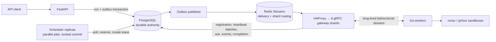

# Agent Fabric

Agent Fabric is a distributed execution control plane for running untrusted repository workloads on resource-aware workers. It keeps the agent payload deliberately simple so the infrastructure problems remain visible: scheduling, sandboxing, failure recovery, resource accounting, observability, and control-plane scale.

[](https://github.com/benjamin05wilson/agent-fabric/actions/workflows/ci.yml)
[](LICENSE)

The repository is benchmark-led. Reported numbers come from committed evidence under [`benchmarks/reports`](benchmarks/reports); failed experiments are kept and are not promoted as successful scale claims.

## Verified results

Measured on 2 September 2026 using a 24-vCPU, 62.5-GiB Docker Desktop allocation unless otherwise noted.

| Experiment | Verified result |
|---|---|
| Gateway scale | **50,000/50,000 durable live gRPC worker streams** |
| 50k integrity workload | **10,000/10,000 jobs succeeded; 0 retries, 0 lost runs, 0 reservation leaks** |
| 50k registration | **31.125 s** |
| Heartbeat load at 50k | approximately **10,000 heartbeats/s** at a 5 s cadence |
| Redis restart recovery | **1,000/1,000 jobs succeeded** with 0 retries, loss, stream errors, unpublished events, or reservation leaks |
| Single-scheduler 50k control | **10,000/10,000 succeeded in 181.254 s; 50.98 placements/s** |
| Parallel scheduler sweep | **2 replicas: 91.97 jobs/s, +36.9%, correctness-clean; 4 clean at 82.78; 8 failed the zero-retry gate** |
| 100k connection attempt | **failed** around 43.8k active streams; not claimed |

Full gateway evidence: [`benchmarks/reports/2026-09-02-gateway-sharding`](benchmarks/reports/2026-09-02-gateway-sharding/README.md).

Parallel scheduler evidence: [`benchmarks/reports/2026-09-02-parallel-scheduler`](benchmarks/reports/2026-09-02-parallel-scheduler/README.md). The full 1/2/4/8 scheduling-plane claim is not made: one, two, and four replicas were correctness-clean, throughput peaked at two, and eight produced 62 expired unacknowledged offers.

> **Frozen portfolio baseline:** 50,000 is the highest verified worker tier for
> `v0.1.0-portfolio`. The failed 100k experiment remains boundary evidence, not
> a target to rerun on Docker Desktop. Any higher-tier claim requires a properly
> tuned Linux host and a fresh, reproducible evidence set.

## Architecture



PostgreSQL is authoritative for runs, attempts, leases, and reservations. Redis is a delivery and wake-up layer rather than the source of truth. Reconciliation reconstructs work from durable state after interruptions.

The connection plane uses **eight Python gateway shards behind HAProxy**. Each shard owns a supervised Redis consumer, local worker connection registry, coalesced heartbeat state, and a bounded bulk-event persistence path.

## What the system demonstrates

- **Agent/workload execution:** lease-based dispatch to long-lived workers over bidirectional gRPC.
- **Resource-aware scheduling:** CPU, memory, PID, GPU, VRAM, capability, project-limit, and priority-aware placement.
- **GPU-aware placement:** CPU-only work preserves scarce accelerator workers when ordinary capacity exists; GPU jobs require matching device/VRAM/capability inventory.
- **Sandboxing:** real workloads execute through a Go worker using gVisor (`runsc`) with a read-only root filesystem, dropped capabilities, non-root UID, CPU/memory/PID/time limits, optional network denial, and cleanup.
- **Failure recovery:** leases, heartbeats, retries, idempotency, worker-loss reconciliation, scheduler restart handling, PostgreSQL restart handling, and supervised Redis reconnects.
- **Observability:** OpenTelemetry, Prometheus, Tempo, Grafana, structured logs, and committed benchmark evidence.
- **Infrastructure as code:** a small AWS Terraform environment for VPC, RDS PostgreSQL, ElastiCache Redis, S3 logs, control-plane compute, gVisor worker ASG, and scoped IAM.

## Engineering findings

The measured bottleneck progression drove the architecture:

- API-hosted outbox publishing stalled for 20–43 s under submission bursts;
  isolating and batching the publisher reduced lag to milliseconds.
- The serial scheduler plateaued at roughly 14–21 placements/s; batch planning,
  targeted locks, and bounded offers removed the per-placement query loop.
- One gateway saturated around 3.9k–4.2k workers at roughly 800 heartbeats/s;
  eight shards, local fanout, and coalesced heartbeats reached 50,000 streams.
- HAProxy then stopped the first 50k run at 41,812 streams; making its connection
  and file-descriptor ceiling explicit allowed the verified tier to pass.
- Scheduler parallelism improved clean throughput through two replicas, stayed
  correct but slower at four, and regressed with retries at eight. Contention,
  not fleet connection capacity, is now the measured scheduling boundary.

The failed 100k connection storm identified Docker Desktop networking and
management APIs as the next host-level boundary. That result is preserved, but
50k remains the frozen public claim until testing moves to Linux.

## Scheduler evolution

The original serial scheduler plateaued at roughly 14-21 placements/s. Batch planning, bounded outstanding offers, and targeted locking improved the 100-worker benchmark from 478 s to 110 s and allowed the 1,000-worker workload to drain cleanly.

The current code also implements **multi-scheduler coordination**:

- queued-run ownership with `FOR UPDATE SKIP LOCKED`;
- independently seeded rotating worker keyset windows;
- exact locked revalidation of CPU, memory, PID, GPU, and VRAM reservations;
- tenant/global limit rechecks under a non-blocking PostgreSQL transaction advisory-lock attempt;
- bounded outstanding lease offers and acknowledgement deadlines;
- Prometheus aggregation across scheduler replicas.

On the 50,000-worker, 10,000-job workload, one, two, and four scheduler replicas were correctness-clean at 67.18, 91.97, and 82.78 jobs/s respectively. Eight replicas regressed to 63.62 jobs/s and produced 62 expired unacknowledged offers. Two replicas therefore improved clean throughput by 36.9%, but the full 1/2/4/8 scaling claim is **not made**.

## Failure and recovery evidence

Worker-loss chaos, PostgreSQL restart, scheduler restart, and Redis restart are exercised by the benchmark/chaos harness.

Earlier 1,000-worker worker-loss tests killed 10% of the fleet mid-run. Every affected run was requeued and eventually completed, with zero final run loss and zero reservation leak. Later gateway-sharding work added supervised Redis readers; a Redis restart during a 1,000-job workload completed **1,000/1,000 jobs** with no retries or lost work.

Detailed reports:

- [`benchmarks/reports/2026-09-01-native-4c16g`](benchmarks/reports/2026-09-01-native-4c16g/README.md)
- [`benchmarks/reports/2026-09-02-batch-scheduler`](benchmarks/reports/2026-09-02-batch-scheduler/README.md)
- [`benchmarks/reports/2026-09-02-gateway-sharding`](benchmarks/reports/2026-09-02-gateway-sharding/README.md)
- [`benchmarks/reports/2026-09-02-parallel-scheduler`](benchmarks/reports/2026-09-02-parallel-scheduler/README.md)

## gVisor sandbox evidence

Hostile workloads were executed through the real Go worker under `runsc`.

| Workload | Outcome | Contained |
|---|---|---|
| Escape probe | non-root UID, no capabilities, gVisor kernel, read-only root, no Docker socket | yes |
| Memory bomb | OOM-killed | yes |
| Fork bomb | terminated at PID limit | yes |
| Infinite loop | timed out | yes |
| `/tmp` exhaustion | `ENOSPC` at 64 MiB tmpfs | yes |
| Forbidden network | DNS and raw TCP unreachable | yes |
| Workspace disk exhaustion | filled the host filesystem and exposed cleanup/logging failure behaviour | **no** |

The failed disk-exhaustion case is intentionally documented rather than hidden. The lease carries a workspace byte limit, but hard enforcement requires a quota-enabled worker filesystem.

## Quick start

The control plane runs under Docker Compose. Real gVisor execution requires a Linux/WSL2 Docker Engine with `runsc` installed.

```powershell
Copy-Item .env.example .env
docker compose up --build -d
curl.exe http://localhost:8000/health
```

Submit a run after a worker registers:

```powershell
$body = @{
  repository = @{ url = "https://github.com/example/project"; ref = "HEAD" }
  argv = @("python", "-m", "pytest", "-q")
  profile = "python"
  network = "disabled"
  resources = @{
    cpu_millis = 1000
    memory_mb = 512
    pids = 128
    disk_mb = 1024
    timeout_seconds = 300
  }
} | ConvertTo-Json -Depth 5

Invoke-RestMethod http://localhost:8000/runs -Method Post `
  -Headers @{ Authorization = "Bearer af_dev_key"; "Idempotency-Key" = "demo-1" } `
  -ContentType application/json -Body $body
```

GPU jobs request accelerator inventory explicitly:

```json
{
  "profile": "cuda",
  "required_capabilities": ["cuda"],
  "resources": {"gpu": 1, "vram_mb": 8192}
}
```

VRAM is scheduler admission accounting, not a hard per-process VRAM limit.

## Real gVisor worker

Install `runsc`, register it with Docker, restart Docker, and verify:

```bash
docker run --rm --runtime=runsc hello-world
```

Then start the worker and hostile-workload harness:

```bash
docker compose --profile gvisor up --build worker
python tests/security/run_hostile.py --api http://localhost:8000 --output hostile-results.json
```

## Development and benchmarks

```powershell
docker run --rm -v "${PWD}/worker:/src" -w /src golang:1.24-bookworm `
  sh -c "/usr/local/go/bin/go test ./..."
docker build -f control-plane/Dockerfile -t agent-fabric-control .
docker compose config --quiet
```

See [`benchmarks/README.md`](benchmarks/README.md) for the native, Docker-scale, chaos, gateway, GPU, and scheduler harnesses.

Additional documentation:

- [Architecture](docs/architecture.md)
- [Scheduler semantics](docs/scheduler.md)
- [Failure handling](docs/failures.md)
- [Sandboxing](docs/sandboxing.md)
- [Threat model](docs/threat-model.md)
- [Scaling methodology](docs/scaling.md)
- [Terraform environment](infra/terraform/README.md)

## License

Released under the [MIT License](LICENSE).

## Limitations

- The verified 50k fleet is **50,000 simulated workers maintaining real gRPC streams**, not 50,000 physical machines.
- The highest verified connection tier on the measured Docker Desktop host is **50,000**. The 100k attempt failed and is not claimed.
- Scheduler replicas are correctness-clean through four processes on the measured 50k workload, but throughput peaks at two; eight replicas regress and produce 62 unacknowledged-offer retries.
- Public HTTPS Git repositories only; no submodules, LFS, private-repository credentials, or secret injection.
- Runtime egress is either disabled or open; there is no domain allowlist claim.
- Workspace disk-byte enforcement needs filesystem quotas. The measured full-disk hostile workload was not contained.
- The Terraform AWS environment passes `terraform validate` and `terraform fmt`, but has not been applied to a real AWS account from this repository.
- Firecracker is a deferred backend.
