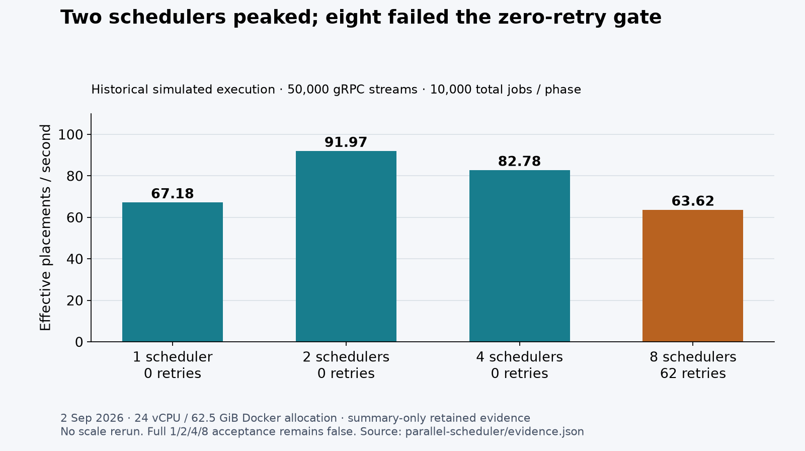

# Readiness evidence — 10 September 2026

**Real CI execution:** [run 34501897886](https://github.com/benjamin05wilson/agent-fabric/actions/runs/34501897886),
source commit `9101a3d1ade0f3e0d765c178681c1c7f113e6783` (clean checkout).
Linux x86_64, Python 3.12.13, Docker 28.0.4, Compose 2.38.2. This run's tiny-demo,
Python, Go and Terraform jobs passed. The separate contracts job failed on the
optional `go_package` identity change; the legacy proto option is restored in the
follow-up commit. Do not describe this entire historical CI run as green.

| Observation | Captured result |
|---|---:|
| Durable simulated workers | 2 |
| Successful jobs / attempts | 8 / 8 |
| Retried / lost / nonterminal runs | 0 / 0 / 0 |
| Outstanding / leaked CPU, memory, PID, GPU, VRAM reservations | all 0 |
| Unpublished outbox events | 0 |
| Client stream error counter | **8** |
| PostgreSQL/Redis regression cases | **5 passed in 3.52 s** |
| Runner including startup, regression tests and cleanup | **27.05 s**, exit 0 |

The error counter records caught gRPC `AioRpcError` exceptions while the simulated
worker is active and reconnecting. Individual causes/timestamps were not retained,
so these eight errors cannot be attributed definitively to startup or another
phase. Durable completion and zero reservations are the acceptance criteria;
this is **not an error-free transport claim**. Seeded execution durations do not
make connection timing or scheduling order deterministic.

- [Complete real terminal transcript](ci/tiny-demo/transcript.txt): exact commands,
  successful five-case regression output and removal of all seven service
  containers plus the private network.
- [Audited result](ci/tiny-demo/result.json): authoritative PostgreSQL outcome,
  full configuration, latency distributions and observed stream errors.
- [Metadata](ci/tiny-demo/metadata.json): exact original source SHA, host/tool versions,
  clean flag, elapsed time and exit status.
- [Preparation transcript](ci/preparation/transcript.txt): image pulls/builds,
  deliberately outside the demo time budget.
- [Provenance manifest](ci-provenance.json): CI URL, original artifact SHA-256s,
  published SHA-256s and sanitization rule. Only the runner checkout path was
  replaced with `<REPO>`; measurements and exit codes were preserved.

For a 60–90-second walkthrough, show the [two commands](../../../docs/demo.md),
open the transcript's loadgen JSON, point at the eight successful attempts and
zero reservations, then show `5 passed` and the final cleanup. The recorded runner
itself took 27 seconds on a prepared CI host. No provider/model/cloud/GPU calls or
hostile workloads were used.

## Historical comparison

Generated with Matplotlib from the committed 2 September summary, not a fresh
scale run. Two schedulers peak at 91.968 effective placements/s; eight record
62 retries and fail the acceptance gate. [SVG](scheduler-comparison.svg),
[generator](../../../scripts/evidence_chart.py), [source/hash](chart-provenance.json).
These summaries lack per-run raw traces and error bars; the chart does not create
missing provenance. The [evidence index](../../EVIDENCE.md) maps each headline to
its actual retained material.

The macOS implementation host has no Docker/runsc. Its [failed local attempt](local-demo-attempt/transcript.txt)
is retained separately, explicitly as a blocked attempt on a dirty working tree;
it is not the successful CI execution. Native Linux/runsc fixture execution remains
an external requirement, detailed in [the real-worker guide](../../../docs/real-worker.md).
